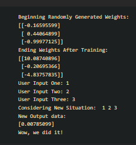

### EX NO: 02
### DATE : 
# <p align ='center'> SIGMOID-ACTIVATION-FUNCTION </p>
## Aim:
  To develop a python code that creates a simple feed-forward neural networks or perception with the Sigmoid activation function. The neuron has to be trained such that it can predict the correct output value when provided with a new set of input data.
  
 

## Equipments Required:
1. Hardware – PCs
2. Anaconda – Python 3.7 Installation / Moodle-Code Runner / Google Colab

## Related Theoritical Concept:
Sigmoid Activation Function is commonly used for models where we have to predict the probability as an output. Since probability of anything exists only between the range of 0 and 1, sigmoid is the right choice because of its range.

The function is differentiable and provides a smooth gradient, i.e., preventing jumps in output values. This is represented by an S-shape of the sigmoid activation function.

The limitations of sigmoid function are :
The derivative of the function is f'(x) = sigmoid(x)*(1-sigmoid(x)).

The output of the logistic function is not symmetric around zero. So the output of all the neurons will be of the same sign. This makes the training of the neural network more difficult and unstable.

## Algorithm
1.Import packages
2.Define neural network class
3.Model single neuron with 3 inputs and 1 output and assign random weights to a 3 x 1 matrix with values between -1 and 1
4.Define sigmoid function and calculate the error
5.Multiply the error by the input and again by the gradient of the sigmoid curve
6.Initialize a single neuron neural network
7.Train neural network using training data
8.Test neural network with new data

## Program:
```
/*
/*
Program to implement the sigmoid activation function in a feed forward ANN.
Developed by: Sai Darshan G
RegisterNumber: 212221240047
*/
import numpy as np
X=np.array(([2,9],[1,5],[3,6]),dtype=float)
y=np.array(([92],[86],[89]),dtype=float)
X=X/np.amax(X,axis=0)
y=y/100

def sigmoid(X):
    return 1/(1+np.exp(-X))
def derivatives_sigmoid(x):
    return x*(1-x)

epoch=7000
lr=0.1
inputlayer_neurons=2 #no of features in dataset
hiddenlayer_neurons=3 #no of hidden layer
output_neurons=1 #no of neuron at output layer

wh=np.random.uniform(size=(inputlayer_neurons,hiddenlayer_neurons))
bh=np.random.uniform(size=(1,hiddenlayer_neurons))
wout=np.random.uniform(size=(hiddenlayer_neurons,output_neurons))
bout=np.random.uniform(size=(1,output_neurons))

for i in range(epoch):
#forward propagation
    hinp1=np.dot(X,wh)
hinp=hinp1+bh
hlayer_act=sigmoid(hinp)
outinp1=np.dot(hlayer_act,wout)
outinp=outinp1+bout
output=sigmoid(outinp)

#backward propagation
EO=y-output
outgrad=derivatives_sigmoid(output)
d_output=EO*outgrad
EH=d_output.dot(wout.T)
hiddengrad=derivatives_sigmoid(hlayer_act)
d_hiddenlayer=EH*hiddengrad
wout+=hlayer_act.T.dot(d_output)*lr
wh+=X.T.dot(d_hiddenlayer)*lr
print("Input:\n"+str(X))
print("Actual Output:\n"+str(y))
print("Predicted Output:\n"+str(output)) 
*/
```

## Output:


## Result:
  Thus created a perception to employ the Sigmoid activation function. This neuron was successfully trained to predict the correct output value, when provided with a new set of input data.
